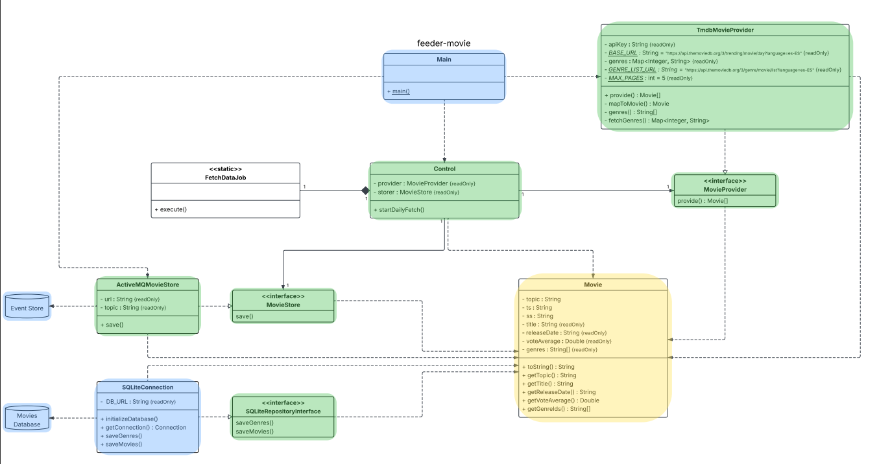
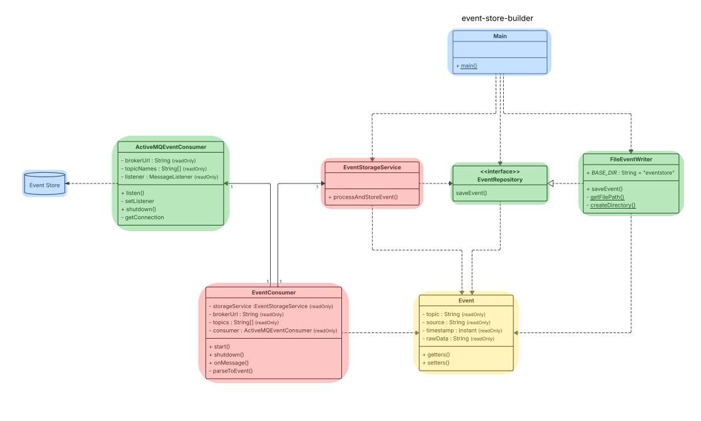
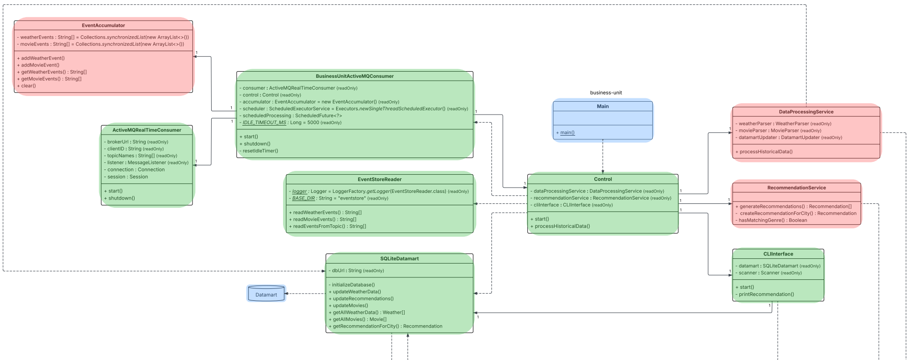

# ClimaticMovie

## Breve descripción del proyecto y su propuesta de valor
Este proyecto es una aplicación que recomienda películas al usuario en función del clima actual de la ciudad en la que se encuentra. La propuesta de valor se basa en ofrecer una experiencia de entretenimiento más contextualizada y personalizada, adaptando las sugerencias de películas a las condiciones meteorológicas del entorno del usuario. Por ejemplo, en un día lluvioso se pueden sugerir dramas o películas introspectivas para disfrutar en casa, mientras que en días soleados se recomiendan películas ligeras, cómicas o de aventuras. Este enfoque mejora la relevancia de las recomendaciones y hace que la experiencia de usuario sea más cercana y atractiva.

## Justificación de la elección de APIs y estructura del datamart
Para alimentar el sistema de recomendaciones, se seleccionaron dos APIs clave:

Por un lado, se utiliza la API de TMDB (The Movie Database) ya que proporciona información diaria sobre las películas trending, lo que garantiza que las recomendaciones se basen en contenidos actuales y populares. Esta API permite acceder a títulos recientes, puntuaciones, géneros y fechas de lanzamiento.

Por otro lado, se integró la API de OpenWeatherMap debido a su fiabilidad y actualización constante. Esta API permite obtener el clima actual de diferentes ciudades con gran precisión, incluyendo temperatura, humedad y condiciones atmosféricas.

En cuanto al datamart, se diseñó con una estructura simple y funcional basada en tres tablas principales:

1. Una tabla que almacena las películas trending del día.

2. Una tabla que guarda los datos meteorológicos actualizados por ciudad.

3. Una tabla que contiene las recomendaciones generadas a partir del cruce de la información anterior, de forma que puedan consultarse de manera rápida y eficiente.

Esta estructura permite mantener separados los datos de entrada y salida, facilitando tanto la consulta como la actualización.

## Instrucciones claras para compilar y ejecutar cada módulo
El orden de ejecución de los módulos es fundamental para asegurar que el sistema funcione correctamente:

Primero, se debe ejecutar el módulo del "business-unit". Este módulo se encarga de procesar los eventos históricos ya guardados, generando las tablas iniciales del datamart con la información existente. Esto garantiza que, desde el primer momento, se disponga de datos suficientes para responder a las consultas de los usuarios.

Una vez iniciado el business-unit, se debe ejecutar el módulo "event-store-builder". Este módulo se mantiene activo, escuchando de manera constante los mensajes que llegan desde el broker, y almacenándolos como eventos históricos.

Por último, se deben ejecutar los módulos "feeder", que son los encargados de enviar la información nueva al broker. Hay un feeder para el clima y otro para las películas. Cada uno de ellos se activa en el momento correspondiente según la programación de actualizaciones, enviando los datos que luego serán consumidos tanto por el business-unit como por el event-store-builder.

De este modo, todo el sistema queda operativo y preparado para recibir, almacenar y procesar información en tiempo real.

## Ejemplos de uso
La interacción principal del usuario con la aplicación se realiza a través de una interfaz de línea de comandos (CLI). Una vez que el sistema está en funcionamiento, el usuario puede escribir el nombre de una ciudad española en la terminal. En respuesta, el sistema le mostrará un conjunto de películas recomendadas basadas en las condiciones meteorológicas actuales de esa ciudad.

Por ejemplo, si el usuario escribe "Madrid", y el clima en Madrid en ese momento es lluvioso y con bajas temperaturas, el sistema podría sugerir películas de géneros como drama, romance o misterio. En cambio, si el clima es soleado y cálido, las recomendaciones tenderán hacia películas de comedia, acción o aventura.

Las instrucciones sobre qué introducir aparecen de forma clara en la propia terminal, guiando al usuario paso a paso.

## Arquitectura del sistema y arquitectura de la aplicación

###  Diagrama feerder movie

### Diagrama feeder weather

### Diagrama event store builder

### Diagrama business-unit

## Principios y patrones de diseño aplicados en cada módulo
Durante el desarrollo del proyecto se ha seguido un enfoque basado en la arquitectura hexagonal. Este enfoque permite separar claramente los componentes del núcleo de negocio de aquellos relacionados con la infraestructura, facilitando la escalabilidad y el mantenimiento del sistema.

Además, se han aplicado varios principios y patrones de diseño, entre los que destacan:

1. El principio de responsabilidad única, asegurando que cada clase cumple con una única función dentro del sistema.

2. La inyección de dependencias, que permite desacoplar los módulos y facilitar las pruebas unitarias.

3. El patrón de listener, usado para la recepción y procesamiento de eventos en tiempo real.

4. El patrón de repositorio, encargado de gestionar el acceso a la base de datos de forma encapsulada.

5. El patrón builder, empleado en el módulo de eventos históricos para construir estructuras a partir de múltiples fuentes.

Estos patrones garantizan un código limpio, modular y fácil de extender, alineado con las buenas prácticas de diseño de software.